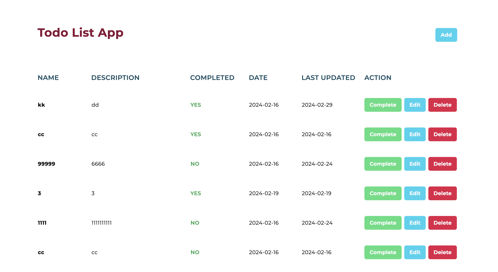

## Next To-Do App

The project is to demo To Do App with CRUD Operation. I have not finished API implemention.



## Table of contents

- [Next To-Do App](#next-to-do-app)
- [Table of contents](#table-of-contents)
- [Getting Started](#getting-started)
- [API Guide](#api-guide)
- [Tech I used](#tech-i-used)
- [Feature](#feature)
- [Design](#design)
- [Learn More](#learn-more)

## Getting Started

1. Install node_modules dependencies`npm install or yarn install`
   
2. Run the development server:

```bash
npm run dev or yarn run dev
```

Go to [Local Dev Link](http://localhost:3000) or 

See [Demo Link](https://next14-to-do-app.vercel.app)

## API Guide

[API Link](https://wayi.league-funny.com/api)

GET 
```bash
#Search todo lise
/task 
```

POST 
```bash
#Add todo 
/task 
```

PUT 
```bash
#Update todo
/task/{id}
```

PATCH 
```bash
#Update todo status
/task/{id}
```

DELETE 
```bash
#Delete todo
/task/{id}
```

## Tech I used

- React
- Next.js 14
- TailwindCSS
- useContext
- useReducer

## Feature

- Responsive Design
- Status of error handling, loading indicators, pagination, sorting, searching
- Deploy to Vercel

## Design

Font

- [Montserrat](https://fonts.google.com/specimen/Montserrat)

Color

- [Slate & Rose & Cyan & Green](https://tailwindcss.com/docs/customizing-colors)

## Learn More

To learn more about the project, take a look at the following resources:

- [How to get current date as a state in ReactJS](https://www.altcademy.com/blog/how-to-get-current-date-as-a-state-in-reactjs/#:~:text=import%20React%2C%20%7B%20useState%20%7D%20from,date%20as%20its%20initial%20state.)